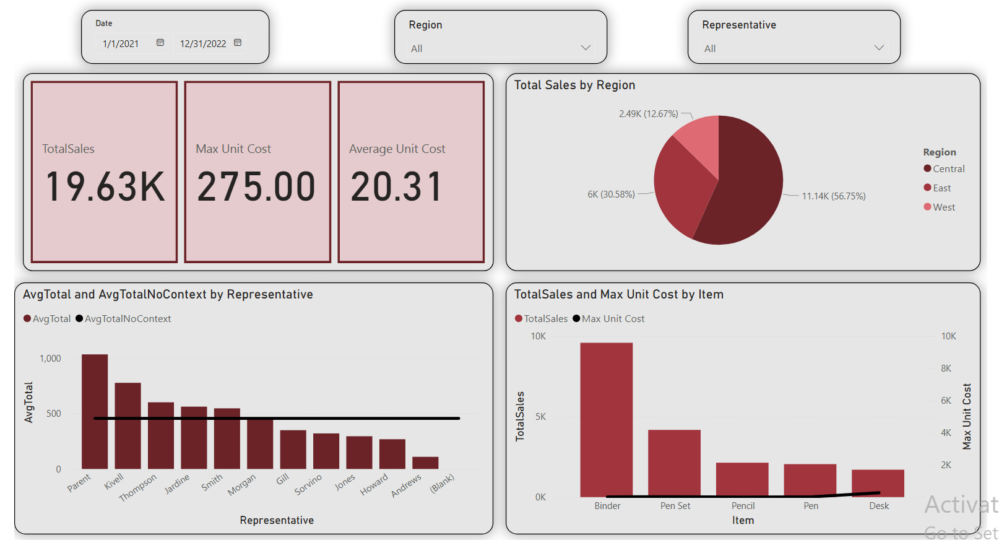

# 📈 Sales Analysis Dashboard – Power BI

This project is a Sales Analysis Dashboard built in Power BI based on client requirements.  
The goal was to provide a clear, interactive visualization of sales performance by region, sales representative, and product item.

🔗 **[Click here to view the interactive dashboard on Power BI](https://app.powerbi.com/links/Ph6GH8T-4G?ctid=917aa155-411f-4e6c-8a5d-5de71287bc0c&pbi_source=linkShare)**

---

## 📌 Project Goals

- Analyze total sales across regions, items, and sales representatives  
- Display KPIs using DAX measures: Total Sales, Average Unit Cost, Max Unit Cost  
- Enable filtering by Order Date, Region, and Sales Rep  
- Present trends and comparisons using multiple visual types:
  - Pie chart for sales by region  
  - Line & clustered column charts for Rep and Item performance

---

## 🧰 Tools & Skills Used

- **Power BI** – Data modeling, visualization, filtering  
- **DAX Measures** – KPIs creation (SUM, MAX, AVERAGE)  
- **Data Cleaning & Transformation**  
- **Dashboard Design**

---

## 📁 Files Included
-`Sales_dashboard.pbix` 
- `sales.xlsx` – Original dataset used for analysis  
- `dashboard_overview.png` – Full dashboard preview  

---

## 📊 Key Insights

1. **Central is the top-performing region**  
   The **Central** region consistently leads in total sales, indicating strong market performance or higher demand compared to other regions.

2. **Binders are the most profitable item**  
   Among all products, **Binders** generate the highest sales revenue, making them the most profitable item in the dataset.

3. **Parent is the highest-selling sales representative**  
   **Parent** stands out as the top-performing sales rep, achieving the highest total sales across all available reps.

---

## 🖼️ Dashboard Preview

---

## 👩‍💻 About Me

this project was part of an assignment simulating a request from a client or account manager from a Data Analytics course.  
The task helped me apply DAX formulas, design with user interaction in mind, and share the dashboard as a Power BI App workspace.

---
